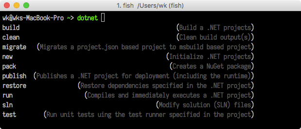

## .NET Completion for Fish



### .NET Command Line

```
- daa = dotnet add <tab>
- dnn = dotnet new <tab>
- drr = dotnet restore <tab>
- duu = dotnet run --project <tab>
- dtt = dotnet test <tab>
- dss = dotnet sln <tab>
- dpp = dotnet pack <tab>
- dbb = dotnet build <tab>
- dcc = dotnet clean
```

### Utility

```
- d-test <tab> <tab>
- d-project <tab>
- d-solution <tab>
- d-root
```

### Cake Build
 
```
- d-cake <tab>
```